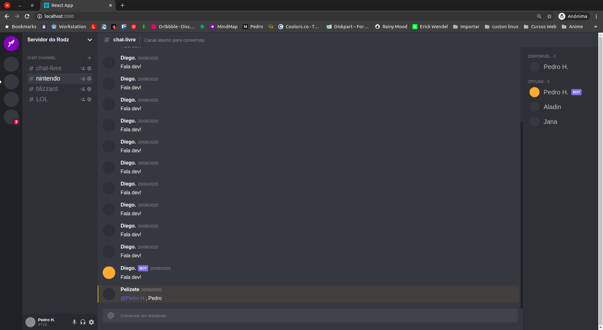

# Clone Discord interface

This project was developed after a Rocketseat tutorial in this video [Link](https://www.youtube.com/watch?v=x4FdZd2-_uU)



## Installation

Use the package manager [npm](https://www.npmjs.com/get-npm) or [yarn](https://classic.yarnpkg.com/pt-BR/docs/install/#debian-stable) to install foobar.

```bash
yarn install
```

## Technologies
1. React

## Usage

```bash
yarn start
```

## Contributing

Pull requests are welcome. For major changes, please open an issue first to discuss what you would like to change.

## License

[MIT](https://choosealicense.com/licenses/mit/)
