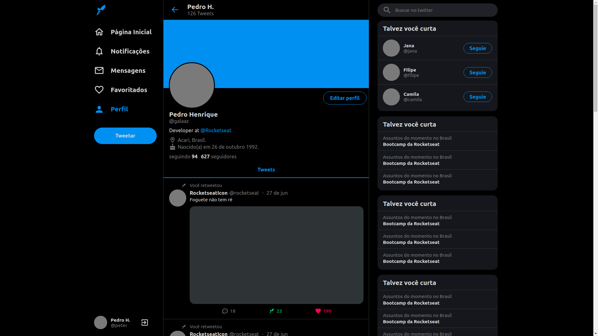

# Clone Twitter interface

This project was developed following the [Rocketseat](https://www.youtube.com/watch?v=K-8z_4xvT3o) video

### Screenshot



The design adapts to different monitor sizes

## Installation

Use the package manager [yarn](https://yarnpkg.com/) to install dependencies.

```bash
yarn install
```

Open http://localhost:3000/

## Contributing

Pull requests are welcome. For major changes, please open an issue first to discuss what you would like to change.

Please make sure to update tests as appropriate.

## License

[MIT](https://choosealicense.com/licenses/mit/)
